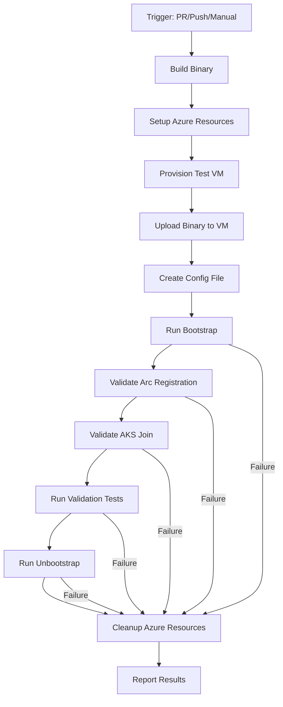

# E2E CI/CD Pipeline Implementation Guide

This guide provides a comprehensive plan for implementing End-to-End (E2E) testing and CI/CD for AKSFlexNode.

## Table of Contents

- [Overview](#overview)
- [Current State](#current-state)
- [E2E Testing Challenges](#e2e-testing-challenges)
- [Architecture Options](#architecture-options)
- [Recommended Implementation](#recommended-implementation)
- [Azure Resources Required](#azure-resources-required)
- [Implementation Steps](#implementation-steps)
- [Workflow Examples](#workflow-examples)
- [Security Considerations](#security-considerations)
- [Cost Estimation](#cost-estimation)
- [Monitoring & Debugging](#monitoring--debugging)

---

## Overview

AKSFlexNode transforms non-Azure VMs into AKS worker nodes through Azure Arc. E2E testing requires:
- Real Azure resources (Arc, AKS, RBAC)
- Ubuntu 22.04 VM environment
- Root/sudo privileges
- Network connectivity to Azure

This guide outlines how to implement automated E2E testing in GitHub Actions.

---

## Current State

### ✅ Existing CI/CD

**PR Checks Workflow** (`.github/workflows/pr-checks.yml`):
- Build verification (Go 1.24, multi-platform)
- Unit tests with race detection
- Code quality (lint, fmt, vet, staticcheck)
- Security scanning (gosec)
- Dependency review
- **Coverage: 30% minimum threshold**

**Release Workflow** (`.github/workflows/release.yml`):
- Triggered on version tags (`v*`)
- Builds linux/amd64 and linux/arm64 binaries
- Creates GitHub releases with checksums

### ❌ Missing: E2E Testing

From `TESTING.md` Future Enhancements:
> - Integration tests with actual Arc registration (requires Azure credentials)
> - E2E tests in containerized environment

---

## E2E Testing Challenges

### 1. **Azure Resource Dependencies**

The bootstrap process requires:
- Azure Arc service (VM registration)
- Azure AD (identity and tokens)
- Azure RBAC (role assignments)
- AKS cluster (target for node join)
- Managed Identity credentials

**Cannot be mocked** - These are external Azure APIs that must be tested against real services.

### 2. **System-Level Operations**

The application requires root privileges to:
- Install binaries to `/usr/local/bin`
- Modify kernel parameters (`/etc/sysctl.d/`)
- Disable swap (`swapoff -a`)
- Manage systemd services
- Create system directories

**Cannot run in standard GitHub Actions runners** - Need VM with sudo access.

### 3. **Platform Specificity**

- **Target OS:** Ubuntu 22.04.5 LTS only
- **Architecture:** x86_64 (amd64) primary
- **Network:** Requires outbound HTTPS to Azure endpoints

### 4. **State Management**

Bootstrap creates persistent state:
- Arc agent installation
- Container runtime setup
- Kubernetes components
- System configuration changes

**Cleanup is critical** - Failed tests can leave resources orphaned.

---

## Architecture Options

### Option 1: Ephemeral Azure VM (Recommended)

**Architecture:**
```
GitHub Actions → Azure CLI/Terraform → Create VM → SSH & Test → Cleanup
```

**Pros:**
- ✅ Clean slate every test run
- ✅ No state management between runs
- ✅ Realistic production environment
- ✅ Parallel test execution possible
- ✅ No persistent infrastructure to manage

**Cons:**
- ❌ Higher Azure costs (~$0.10-0.50 per test run)
- ❌ Slower (5-10 min VM provisioning)
- ❌ More complex orchestration

**Best for:** Release validation, pre-merge testing, nightly builds

---

### Option 2: Self-Hosted GitHub Runner

**Architecture:**
```
GitHub Actions → Self-Hosted Runner (Ubuntu VM) → Run Tests Locally
```

**Pros:**
- ✅ Fast execution (no VM provisioning)
- ✅ Lower ongoing costs
- ✅ More control over environment
- ✅ Can debug interactively

**Cons:**
- ❌ Requires persistent VM management
- ❌ State cleanup between runs critical
- ❌ Security considerations for runner
- ❌ Cannot run tests in parallel easily

**Best for:** Frequent PR testing, developer feedback loops

---

### Option 3: Hybrid Approach

**Strategy:**
- **Self-hosted runner** for quick PR validation
- **Ephemeral VMs** for release candidates and nightly builds

**Pros:**
- ✅ Fast feedback for developers
- ✅ High confidence for releases
- ✅ Cost-optimized

**Cons:**
- ❌ Most complex to set up
- ❌ Two systems to maintain

---

## Recommended Implementation

**Primary: Ephemeral Azure VM E2E Testing**

### High-Level Flow



### Key Components

1. **Azure Infrastructure Module** (Terraform or Azure CLI)
2. **GitHub Actions Workflow** (`.github/workflows/e2e-tests.yml`)
3. **E2E Test Scripts** (`scripts/e2e/`)
4. **Validation Suite** (Post-bootstrap checks)

---

## Azure Resources Required

### Required Azure Resources

#### 1. **Test Resource Group**
```
Name: rg-aksflexnode-e2e-tests
Purpose: Container for all test resources
Lifecycle: Ephemeral (created/deleted per test)
```

#### 2. **Test AKS Cluster** (Two Options)

**Option A: Persistent Test Cluster (Recommended)**
```yaml
Name: aks-flexnode-e2e-cluster
Node Count: 1 (minimum for cost)
VM Size: Standard_B2s
Lifecycle: Persistent (manually managed)
Cost: ~$30-50/month
```

**Option B: Ephemeral Cluster**
```yaml
Created: Per test run
Deleted: After test
Cost: ~$0.50 per test run
Time: +10 minutes per test
```

**Recommendation:** Use persistent cluster to reduce test time and cost.

#### 3. **Test VM** (Ephemeral)
```yaml
OS: Ubuntu 22.04 LTS
Size: Standard_B2ms (2 vCPU, 8GB RAM)
Disk: 30GB Standard SSD
Lifecycle: Created and deleted per test
Cost: ~$0.10-0.30 per test (5-15 min runtime)
```

#### 4. **Service Principal for CI/CD**
```yaml
Name: sp-aksflexnode-e2e
Required Roles:
  - Contributor (on test resource group)
  - Azure Connected Machine Onboarding (for Arc)
  - User Access Administrator (for RBAC assignments)
  - Azure Kubernetes Service Cluster Admin Role (on AKS cluster)
```

#### 5. **GitHub Secrets**
```yaml
AZURE_SUBSCRIPTION_ID: Your subscription ID
AZURE_TENANT_ID: Your tenant ID
AZURE_CLIENT_ID: Service principal client ID
AZURE_CLIENT_SECRET: Service principal client secret
E2E_RESOURCE_GROUP: Test resource group name
E2E_AKS_CLUSTER_NAME: Test AKS cluster name
E2E_AKS_RESOURCE_ID: Full resource ID of test cluster
```

---

## Implementation Steps

### Phase 1: Azure Setup (One-Time)

#### Step 1.1: Create Test AKS Cluster

```bash
# Set variables
RESOURCE_GROUP="rg-aksflexnode-e2e-tests"
LOCATION="westus"
CLUSTER_NAME="aks-flexnode-e2e-cluster"

# Create resource group
az group create \
  --name $RESOURCE_GROUP \
  --location $LOCATION

# Create AKS cluster with Azure RBAC
az aks create \
  --resource-group $RESOURCE_GROUP \
  --name $CLUSTER_NAME \
  --node-count 1 \
  --node-vm-size Standard_B2s \
  --enable-managed-identity \
  --enable-azure-rbac \
  --network-plugin azure \
  --generate-ssh-keys

# Get cluster resource ID (needed for config)
az aks show \
  --resource-group $RESOURCE_GROUP \
  --name $CLUSTER_NAME \
  --query id -o tsv
```

#### Step 1.2: Create Service Principal

```bash
# Create service principal
SP_NAME="sp-aksflexnode-e2e"
SP_OUTPUT=$(az ad sp create-for-rbac \
  --name $SP_NAME \
  --role Contributor \
  --scopes /subscriptions/$(az account show --query id -o tsv)/resourceGroups/$RESOURCE_GROUP)

# Extract credentials
CLIENT_ID=$(echo $SP_OUTPUT | jq -r '.appId')
CLIENT_SECRET=$(echo $SP_OUTPUT | jq -r '.password')
TENANT_ID=$(echo $SP_OUTPUT | jq -r '.tenant')

# Assign additional roles
SUBSCRIPTION_ID=$(az account show --query id -o tsv)
AKS_RESOURCE_ID=$(az aks show -g $RESOURCE_GROUP -n $CLUSTER_NAME --query id -o tsv)

# Arc onboarding role (on resource group)
az role assignment create \
  --assignee $CLIENT_ID \
  --role "Azure Connected Machine Onboarding" \
  --scope /subscriptions/$SUBSCRIPTION_ID/resourceGroups/$RESOURCE_GROUP

# User Access Administrator (to assign roles to Arc MSI)
az role assignment create \
  --assignee $CLIENT_ID \
  --role "User Access Administrator" \
  --scope $AKS_RESOURCE_ID

# AKS Cluster Admin
az role assignment create \
  --assignee $CLIENT_ID \
  --role "Azure Kubernetes Service Cluster Admin Role" \
  --scope $AKS_RESOURCE_ID

echo "Client ID: $CLIENT_ID"
echo "Client Secret: $CLIENT_SECRET"
echo "Tenant ID: $TENANT_ID"
```

#### Step 1.3: Configure GitHub Secrets

Go to GitHub repository → Settings → Secrets and variables → Actions → New repository secret:

```yaml
AZURE_SUBSCRIPTION_ID: <your-subscription-id>
AZURE_TENANT_ID: <tenant-id-from-step-1.2>
AZURE_CLIENT_ID: <client-id-from-step-1.2>
AZURE_CLIENT_SECRET: <client-secret-from-step-1.2>
E2E_RESOURCE_GROUP: rg-aksflexnode-e2e-tests
E2E_AKS_CLUSTER_NAME: aks-flexnode-e2e-cluster
E2E_AKS_RESOURCE_ID: <resource-id-from-step-1.1>
E2E_LOCATION: westus
```

---

### Phase 2: Create E2E Test Infrastructure

#### Step 2.1: Create Directory Structure

```bash
mkdir -p scripts/e2e
mkdir -p scripts/e2e/terraform
```

#### Step 2.2: Terraform Configuration (Option A - Recommended)

Create `scripts/e2e/terraform/main.tf`:

```hcl
terraform {
  required_version = ">= 1.0"
  required_providers {
    azurerm = {
      source  = "hashicorp/azurerm"
      version = "~> 3.0"
    }
  }
}

provider "azurerm" {
  features {}
  subscription_id = var.subscription_id
  tenant_id       = var.tenant_id
  client_id       = var.client_id
  client_secret   = var.client_secret
}

variable "subscription_id" {}
variable "tenant_id" {}
variable "client_id" {}
variable "client_secret" {}
variable "resource_group" {}
variable "location" {}
variable "vm_name" {
  default = "vm-e2e-test"
}

# Create VM for testing
resource "azurerm_virtual_network" "test" {
  name                = "vnet-e2e-${var.vm_name}"
  address_space       = ["10.0.0.0/16"]
  location            = var.location
  resource_group_name = var.resource_group
}

resource "azurerm_subnet" "test" {
  name                 = "subnet-e2e"
  resource_group_name  = var.resource_group
  virtual_network_name = azurerm_virtual_network.test.name
  address_prefixes     = ["10.0.1.0/24"]
}

resource "azurerm_network_interface" "test" {
  name                = "nic-${var.vm_name}"
  location            = var.location
  resource_group_name = var.resource_group

  ip_configuration {
    name                          = "internal"
    subnet_id                     = azurerm_subnet.test.id
    private_ip_address_allocation = "Dynamic"
    public_ip_address_id          = azurerm_public_ip.test.id
  }
}

resource "azurerm_public_ip" "test" {
  name                = "pip-${var.vm_name}"
  location            = var.location
  resource_group_name = var.resource_group
  allocation_method   = "Static"
  sku                 = "Standard"
}

resource "azurerm_linux_virtual_machine" "test" {
  name                = var.vm_name
  location            = var.location
  resource_group_name = var.resource_group
  size                = "Standard_B2ms"
  admin_username      = "azureuser"
  network_interface_ids = [
    azurerm_network_interface.test.id,
  ]

  admin_ssh_key {
    username   = "azureuser"
    public_key = file("~/.ssh/id_rsa.pub")
  }

  os_disk {
    caching              = "ReadWrite"
    storage_account_type = "Premium_LRS"
    disk_size_gb         = 30
  }

  source_image_reference {
    publisher = "Canonical"
    offer     = "0001-com-ubuntu-server-jammy"
    sku       = "22_04-lts-gen2"
    version   = "latest"
  }
}

output "vm_public_ip" {
  value = azurerm_public_ip.test.ip_address
}

output "vm_name" {
  value = azurerm_linux_virtual_machine.test.name
}
```

#### Step 2.3: Azure CLI Script (Option B - Simpler)

Create `scripts/e2e/provision-vm.sh`:

```bash
#!/bin/bash
set -euo pipefail

# Variables
RESOURCE_GROUP="${1:-$E2E_RESOURCE_GROUP}"
LOCATION="${2:-$E2E_LOCATION}"
VM_NAME="vm-e2e-test-$(date +%s)"
VM_SIZE="Standard_B2ms"
IMAGE="Canonical:0001-com-ubuntu-server-jammy:22_04-lts-gen2:latest"
ADMIN_USER="azureuser"

echo "Creating test VM: $VM_NAME in $RESOURCE_GROUP"

# Create VM with public IP
az vm create \
  --resource-group "$RESOURCE_GROUP" \
  --name "$VM_NAME" \
  --location "$LOCATION" \
  --image "$IMAGE" \
  --size "$VM_SIZE" \
  --admin-username "$ADMIN_USER" \
  --generate-ssh-keys \
  --public-ip-sku Standard \
  --output json > vm-info.json

# Extract public IP
PUBLIC_IP=$(jq -r '.publicIpAddress' vm-info.json)

echo "VM created successfully"
echo "Public IP: $PUBLIC_IP"
echo "VM Name: $VM_NAME"

# Output for GitHub Actions
echo "VM_NAME=$VM_NAME" >> $GITHUB_ENV
echo "VM_PUBLIC_IP=$PUBLIC_IP" >> $GITHUB_ENV
echo "VM_ADMIN_USER=$ADMIN_USER" >> $GITHUB_ENV

# Wait for VM to be ready
echo "Waiting for VM to be ready..."
sleep 30

# Test SSH connectivity
for i in {1..10}; do
  if ssh -o StrictHostKeyChecking=no -o ConnectTimeout=5 "$ADMIN_USER@$PUBLIC_IP" "echo 'SSH ready'"; then
    echo "VM is ready for testing"
    exit 0
  fi
  echo "Attempt $i/10: VM not ready yet, waiting..."
  sleep 10
done

echo "ERROR: VM failed to become ready"
exit 1
```

Create `scripts/e2e/cleanup-vm.sh`:

```bash
#!/bin/bash
set -euo pipefail

RESOURCE_GROUP="${1:-$E2E_RESOURCE_GROUP}"
VM_NAME="${2:-$VM_NAME}"

echo "Cleaning up VM: $VM_NAME"

# Delete VM and associated resources
az vm delete \
  --resource-group "$RESOURCE_GROUP" \
  --name "$VM_NAME" \
  --yes \
  --no-wait

# Clean up network resources
NIC_ID=$(az vm show -g "$RESOURCE_GROUP" -n "$VM_NAME" --query 'networkProfile.networkInterfaces[0].id' -o tsv 2>/dev/null || echo "")
if [[ -n "$NIC_ID" ]]; then
  az network nic delete --ids "$NIC_ID" --no-wait
fi

echo "Cleanup initiated (running in background)"
```

---

### Phase 3: Create E2E Test Scripts

#### Step 3.1: Bootstrap Test Script

Create `scripts/e2e/test-bootstrap.sh`:

```bash
#!/bin/bash
set -euo pipefail

# This script runs ON the test VM via SSH
# It installs and tests aks-flex-node

BINARY_PATH="${1:-/tmp/aks-flex-node}"
CONFIG_PATH="${2:-/tmp/config.json}"
LOG_DIR="/var/log/aks-flex-node"

echo "=========================================="
echo "AKS Flex Node E2E Bootstrap Test"
echo "=========================================="

# Install binary
echo "[1/8] Installing aks-flex-node binary..."
sudo cp "$BINARY_PATH" /usr/local/bin/aks-flex-node
sudo chmod +x /usr/local/bin/aks-flex-node
aks-flex-node version

# Setup config directory
echo "[2/8] Setting up configuration..."
sudo mkdir -p /etc/aks-flex-node
sudo mkdir -p "$LOG_DIR"
sudo cp "$CONFIG_PATH" /etc/aks-flex-node/config.json

# Run bootstrap
echo "[3/8] Running bootstrap..."
sudo aks-flex-node bootstrap --config /etc/aks-flex-node/config.json

# Check bootstrap exit code
if [ $? -ne 0 ]; then
  echo "❌ Bootstrap failed"
  cat "$LOG_DIR/aks-flex-node.log"
  exit 1
fi

echo "✅ Bootstrap completed successfully"

# Validation checks
echo "[4/8] Validating Arc registration..."
if sudo azcmagent show &>/dev/null; then
  echo "✅ Arc agent is registered"
  sudo azcmagent show
else
  echo "❌ Arc agent not found or not registered"
  exit 1
fi

echo "[5/8] Validating containerd..."
if systemctl is-active --quiet containerd; then
  echo "✅ containerd is running"
else
  echo "❌ containerd is not running"
  systemctl status containerd
  exit 1
fi

echo "[6/8] Validating kubelet..."
if systemctl is-active --quiet kubelet; then
  echo "✅ kubelet is running"
else
  echo "❌ kubelet is not running"
  systemctl status kubelet
  journalctl -u kubelet -n 50 --no-pager
  exit 1
fi

echo "[7/8] Checking kubeconfig..."
if [ -f /etc/kubernetes/kubelet.conf ]; then
  echo "✅ kubelet.conf exists"
else
  echo "❌ kubelet.conf not found"
  exit 1
fi

echo "[8/8] Checking kubelet node registration..."
# Wait up to 2 minutes for node to register
for i in {1..24}; do
  if sudo kubectl --kubeconfig /etc/kubernetes/kubelet.conf get nodes | grep -q "$(hostname)"; then
    echo "✅ Node is registered with cluster"
    sudo kubectl --kubeconfig /etc/kubernetes/kubelet.conf get nodes
    break
  fi
  if [ $i -eq 24 ]; then
    echo "⚠️  Node not yet registered (may take more time)"
    sudo kubectl --kubeconfig /etc/kubernetes/kubelet.conf get nodes || true
  else
    echo "Waiting for node registration... ($i/24)"
    sleep 5
  fi
done

echo "=========================================="
echo "✅ E2E Bootstrap Test Completed"
echo "=========================================="
```

#### Step 3.2: Unbootstrap Test Script

Create `scripts/e2e/test-unbootstrap.sh`:

```bash
#!/bin/bash
set -euo pipefail

LOG_DIR="/var/log/aks-flex-node"

echo "=========================================="
echo "AKS Flex Node E2E Unbootstrap Test"
echo "=========================================="

echo "[1/5] Running unbootstrap..."
sudo aks-flex-node unbootstrap --config /etc/aks-flex-node/config.json

# Check exit code but continue validation
if [ $? -ne 0 ]; then
  echo "⚠️  Unbootstrap reported errors (checking cleanup)"
  cat "$LOG_DIR/aks-flex-node.log"
fi

echo "[2/5] Verifying kubelet stopped..."
if ! systemctl is-active --quiet kubelet; then
  echo "✅ kubelet is stopped"
else
  echo "⚠️  kubelet is still running"
fi

echo "[3/5] Verifying containerd stopped..."
if ! systemctl is-active --quiet containerd; then
  echo "✅ containerd is stopped"
else
  echo "⚠️  containerd is still running"
fi

echo "[4/5] Verifying Arc disconnection..."
if ! sudo azcmagent show &>/dev/null; then
  echo "✅ Arc agent is disconnected"
else
  echo "⚠️  Arc agent still shows connection"
fi

echo "[5/5] Checking cleanup..."
LEFTOVER=0

if [ -f /etc/kubernetes/kubelet.conf ]; then
  echo "⚠️  kubelet.conf still exists"
  LEFTOVER=1
fi

if systemctl list-unit-files | grep -q containerd; then
  if systemctl is-enabled --quiet containerd 2>/dev/null; then
    echo "⚠️  containerd service still enabled"
    LEFTOVER=1
  fi
fi

if [ $LEFTOVER -eq 0 ]; then
  echo "✅ Cleanup successful"
else
  echo "⚠️  Some resources remain (acceptable for unbootstrap)"
fi

echo "=========================================="
echo "✅ E2E Unbootstrap Test Completed"
echo "=========================================="
```

Make scripts executable:
```bash
chmod +x scripts/e2e/*.sh
```

---

### Phase 4: Create GitHub Actions Workflow

Create `.github/workflows/e2e-tests.yml`:

```yaml
name: E2E Tests

on:
  # Manual trigger for testing
  workflow_dispatch:
    inputs:
      cleanup_on_failure:
        description: 'Cleanup resources even if tests fail'
        required: false
        default: true
        type: boolean

  # Uncomment to enable on PRs (will increase Azure costs)
  # pull_request:
  #   branches: [main, dev]

  # Uncomment for nightly builds
  # schedule:
  #   - cron: '0 2 * * *'  # 2 AM UTC daily

  # Run on release tags
  push:
    tags:
      - 'v*'

permissions:
  contents: read

env:
  GO_VERSION: '1.24'
  AZURE_LOCATION: westus

jobs:
  e2e-test:
    name: E2E Test on Azure VM
    runs-on: ubuntu-latest
    timeout-minutes: 30

    steps:
      - name: Checkout code
        uses: actions/checkout@v4

      - name: Set up Go
        uses: actions/setup-go@v5
        with:
          go-version: ${{ env.GO_VERSION }}
          cache: true

      - name: Build binary for E2E testing
        run: |
          VERSION="${GITHUB_REF_NAME:-dev}"
          GIT_COMMIT=$(git rev-parse --short HEAD)
          BUILD_DATE=$(date -u +"%Y-%m-%dT%H:%M:%SZ")

          LDFLAGS="-X main.Version=${VERSION} -X main.GitCommit=${GIT_COMMIT} -X main.BuildTime=${BUILD_DATE}"

          GOOS=linux GOARCH=amd64 go build -ldflags "${LDFLAGS}" -o aks-flex-node .
          chmod +x aks-flex-node

      - name: Azure Login
        uses: azure/login@v1
        with:
          creds: '{"clientId":"${{ secrets.AZURE_CLIENT_ID }}","clientSecret":"${{ secrets.AZURE_CLIENT_SECRET }}","subscriptionId":"${{ secrets.AZURE_SUBSCRIPTION_ID }}","tenantId":"${{ secrets.AZURE_TENANT_ID }}"}'

      - name: Provision Test VM
        id: provision
        run: |
          chmod +x scripts/e2e/provision-vm.sh

          export E2E_RESOURCE_GROUP="${{ secrets.E2E_RESOURCE_GROUP }}"
          export E2E_LOCATION="${{ secrets.E2E_LOCATION || env.AZURE_LOCATION }}"

          ./scripts/e2e/provision-vm.sh

      - name: Generate test config
        run: |
          UNIQUE_NAME="e2e-node-$(date +%s)"

          cat > config.json <<EOF
          {
            "azure": {
              "subscriptionId": "${{ secrets.AZURE_SUBSCRIPTION_ID }}",
              "tenantId": "${{ secrets.AZURE_TENANT_ID }}",
              "cloud": "AzurePublicCloud",
              "servicePrincipal": {
                "clientId": "${{ secrets.AZURE_CLIENT_ID }}",
                "clientSecret": "${{ secrets.AZURE_CLIENT_SECRET }}"
              },
              "arc": {
                "machineName": "${UNIQUE_NAME}",
                "resourceGroup": "${{ secrets.E2E_RESOURCE_GROUP }}",
                "location": "${{ secrets.E2E_LOCATION || env.AZURE_LOCATION }}",
                "autoRoleAssignment": true,
                "tags": {
                  "environment": "e2e-test",
                  "github-run": "${{ github.run_id }}"
                }
              },
              "targetCluster": {
                "resourceId": "${{ secrets.E2E_AKS_RESOURCE_ID }}",
                "location": "${{ secrets.E2E_LOCATION || env.AZURE_LOCATION }}"
              }
            },
            "agent": {
              "logLevel": "debug",
              "logDir": "/var/log/aks-flex-node"
            }
          }
          EOF

      - name: Upload binary and config to VM
        env:
          VM_PUBLIC_IP: ${{ env.VM_PUBLIC_IP }}
          VM_ADMIN_USER: ${{ env.VM_ADMIN_USER }}
        run: |
          # Add SSH key to known hosts
          ssh-keyscan -H $VM_PUBLIC_IP >> ~/.ssh/known_hosts

          # Upload files
          scp aks-flex-node ${VM_ADMIN_USER}@${VM_PUBLIC_IP}:/tmp/
          scp config.json ${VM_ADMIN_USER}@${VM_PUBLIC_IP}:/tmp/

          # Upload test scripts
          scp scripts/e2e/test-bootstrap.sh ${VM_ADMIN_USER}@${VM_PUBLIC_IP}:/tmp/
          scp scripts/e2e/test-unbootstrap.sh ${VM_ADMIN_USER}@${VM_PUBLIC_IP}:/tmp/
          ssh ${VM_ADMIN_USER}@${VM_PUBLIC_IP} "chmod +x /tmp/test-*.sh"

      - name: Run bootstrap test
        id: bootstrap
        env:
          VM_PUBLIC_IP: ${{ env.VM_PUBLIC_IP }}
          VM_ADMIN_USER: ${{ env.VM_ADMIN_USER }}
        run: |
          ssh ${VM_ADMIN_USER}@${VM_PUBLIC_IP} "/tmp/test-bootstrap.sh /tmp/aks-flex-node /tmp/config.json"

      - name: Collect logs on bootstrap failure
        if: failure() && steps.bootstrap.outcome == 'failure'
        env:
          VM_PUBLIC_IP: ${{ env.VM_PUBLIC_IP }}
          VM_ADMIN_USER: ${{ env.VM_ADMIN_USER }}
        run: |
          mkdir -p logs
          ssh ${VM_ADMIN_USER}@${VM_PUBLIC_IP} "sudo cat /var/log/aks-flex-node/aks-flex-node.log" > logs/aks-flex-node.log || true
          ssh ${VM_ADMIN_USER}@${VM_PUBLIC_IP} "sudo journalctl -u kubelet -n 100 --no-pager" > logs/kubelet.log || true
          ssh ${VM_ADMIN_USER}@${VM_PUBLIC_IP} "sudo journalctl -u containerd -n 100 --no-pager" > logs/containerd.log || true

      - name: Run unbootstrap test
        if: always() && steps.bootstrap.outcome == 'success'
        env:
          VM_PUBLIC_IP: ${{ env.VM_PUBLIC_IP }}
          VM_ADMIN_USER: ${{ env.VM_ADMIN_USER }}
        run: |
          ssh ${VM_ADMIN_USER}@${VM_PUBLIC_IP} "/tmp/test-unbootstrap.sh"

      - name: Collect final logs
        if: always()
        env:
          VM_PUBLIC_IP: ${{ env.VM_PUBLIC_IP }}
          VM_ADMIN_USER: ${{ env.VM_ADMIN_USER }}
        run: |
          mkdir -p logs
          ssh ${VM_ADMIN_USER}@${VM_PUBLIC_IP} "sudo cat /var/log/aks-flex-node/aks-flex-node.log" > logs/aks-flex-node-final.log || true

      - name: Upload logs as artifacts
        if: always()
        uses: actions/upload-artifact@v4
        with:
          name: e2e-logs
          path: logs/

      - name: Cleanup Test VM
        if: always() && (success() || inputs.cleanup_on_failure)
        run: |
          chmod +x scripts/e2e/cleanup-vm.sh

          export E2E_RESOURCE_GROUP="${{ secrets.E2E_RESOURCE_GROUP }}"
          export VM_NAME="${{ env.VM_NAME }}"

          ./scripts/e2e/cleanup-vm.sh || echo "Cleanup had issues (non-critical)"

      - name: Cleanup Arc Registration
        if: always()
        run: |
          # Find and delete Arc machines created by this run
          UNIQUE_NAME="e2e-node-*"
          az connectedmachine list \
            --resource-group "${{ secrets.E2E_RESOURCE_GROUP }}" \
            --query "[?tags.\"github-run\"=='${{ github.run_id }}'].name" -o tsv | \
          while read -r machine; do
            echo "Deleting Arc machine: $machine"
            az connectedmachine delete \
              --resource-group "${{ secrets.E2E_RESOURCE_GROUP }}" \
              --name "$machine" \
              --yes || true
          done

      - name: Report test results
        if: always()
        run: |
          if [ "${{ steps.bootstrap.outcome }}" == "success" ]; then
            echo "✅ E2E tests passed"
            exit 0
          else
            echo "❌ E2E tests failed"
            echo "Check the uploaded logs artifact for details"
            exit 1
          fi
```

---

## Security Considerations

### 1. **Secret Management**

**GitHub Secrets Security:**
- Never log secrets in workflow output
- Use short-lived service principals where possible
- Rotate credentials regularly
- Limit service principal scope to test resource group only

**Best Practices:**
```yaml
# ❌ BAD - Logs secret
- run: echo "Client ID: ${{ secrets.AZURE_CLIENT_ID }}"

# ✅ GOOD - Masks output
- run: echo "::add-mask::${{ secrets.AZURE_CLIENT_SECRET }}"
```

### 2. **Network Security**

**VM Security:**
- VMs created with public IPs (required for GitHub Actions SSH)
- Consider NSG rules to restrict SSH to GitHub Actions IP ranges
- VMs are ephemeral (deleted after test)

**Production Alternative:**
```yaml
# Use Azure Bastion for more secure access
# Or use self-hosted runners in private network
```

### 3. **RBAC Principle of Least Privilege**

Service principal should have:
- ✅ Contributor on test resource group only
- ✅ Specific roles on test AKS cluster only
- ❌ No subscription-wide permissions
- ❌ No production resource access

### 4. **Resource Cleanup**

**Critical for security and cost:**
- Always cleanup VMs (even on failure)
- Monitor for orphaned Arc registrations
- Set Azure Policy to auto-delete old resources
- Use resource tags for tracking

```bash
# Periodic cleanup script
az resource list \
  --tag github-workflow=e2e-tests \
  --query "[?tags.created_at < '$(date -d '7 days ago' +%Y-%m-%d)'].id" \
  -o tsv | xargs -I {} az resource delete --ids {}
```

---

## Cost Estimation

### Monthly Cost Breakdown

**Scenario 1: Manual/Release Only** (5 runs/month)
```
Test VM (Standard_B2ms):  $0.30 × 5 = $1.50
Persistent AKS Cluster:   $30-50/month
Total: ~$32-52/month
```

**Scenario 2: PR Testing** (50 runs/month)
```
Test VM (Standard_B2ms):  $0.30 × 50 = $15
Persistent AKS Cluster:   $30-50/month
Total: ~$45-65/month
```

**Scenario 3: Nightly + Releases** (35 runs/month)
```
Test VM (Standard_B2ms):  $0.30 × 35 = $10.50
Persistent AKS Cluster:   $30-50/month
Total: ~$40-60/month
```

### Cost Optimization Tips

1. **Use B-series burstable VMs** - Already doing this (Standard_B2ms)
2. **Keep AKS cluster minimal** - 1 node, smallest size
3. **Enable auto-shutdown** on test cluster during non-working hours
4. **Use Azure Dev/Test pricing** if eligible
5. **Delete VMs immediately** after test completion
6. **Consider Azure Spot VMs** for test VMs (up to 90% savings)

```bash
# Use Spot VM for testing (add to provision script)
az vm create \
  --priority Spot \
  --max-price 0.05 \
  --eviction-policy Delete \
  # ... other parameters
```

---

## Monitoring & Debugging

### 1. **Workflow Monitoring**

**GitHub Actions UI:**
- Check workflow runs: Actions tab → E2E Tests
- View logs for each step
- Download artifacts (logs) for failed runs

**Monitoring Checklist:**
```
□ Check VM provisioning time (should be < 5 min)
□ Verify SSH connectivity
□ Monitor bootstrap step duration (should be < 10 min)
□ Check Arc registration success rate
□ Verify node joins cluster within 2 minutes
□ Ensure cleanup completes
```

### 2. **Azure Portal Monitoring**

**Resources to monitor:**
- **Resource Group** - Verify no orphaned VMs
- **Arc Connected Machines** - Check for stale registrations
- **AKS Cluster** - Verify nodes are cleaned up
- **Cost Analysis** - Track E2E testing costs

### 3. **Debugging Failed Tests**

**Step-by-step debugging:**

1. **Download logs artifact** from failed workflow
   - `logs/aks-flex-node.log` - Main application log
   - `logs/kubelet.log` - Kubelet issues
   - `logs/containerd.log` - Container runtime issues

2. **Check specific failure points:**
   ```bash
   # Arc registration failed
   grep "Arc registration" logs/aks-flex-node.log

   # Kubelet not starting
   grep "ERROR\|FATAL" logs/kubelet.log

   # Container runtime issues
   grep "ERROR" logs/containerd.log
   ```

3. **Re-run with debug logging:**
   - Modify workflow to use `logLevel: "debug"` in config
   - Add `set -x` to bash scripts for verbose output

4. **Manual testing:**
   ```bash
   # Provision VM manually for debugging
   az vm create ... # use same parameters

   # SSH to VM
   ssh azureuser@<public-ip>

   # Run bootstrap manually with debug
   sudo /usr/local/bin/aks-flex-node bootstrap \
     --config /etc/aks-flex-node/config.json \
     2>&1 | tee bootstrap-debug.log
   ```

### 4. **Common Issues & Solutions**

| Issue | Symptom | Solution |
|-------|---------|----------|
| **SSH timeout** | Cannot connect to VM | Increase wait time, check NSG rules |
| **Arc registration fails** | "Failed to register with Arc" | Verify service principal has `Azure Connected Machine Onboarding` role |
| **RBAC assignment fails** | "Failed to assign role to Arc MSI" | Verify SP has `User Access Administrator` on AKS cluster |
| **Kubelet won't start** | kubelet service fails | Check `/var/log/aks-flex-node/aks-flex-node.log` for kubeconfig issues |
| **Node not joining cluster** | Node doesn't appear in cluster | Verify network connectivity from VM to AKS API server (port 443) |
| **Cleanup fails** | Resources remain | Manually clean up via Azure Portal, improve cleanup script |

---

## Next Steps

### Phase 5: Implementation Checklist

- [ ] **Azure Setup** (Steps 1.1 - 1.3)
  - [ ] Create test AKS cluster
  - [ ] Create service principal
  - [ ] Configure GitHub secrets

- [ ] **Create Scripts** (Steps 2.2 - 3.2)
  - [ ] Choose Terraform or Azure CLI approach
  - [ ] Create VM provisioning script
  - [ ] Create VM cleanup script
  - [ ] Create bootstrap test script
  - [ ] Create unbootstrap test script
  - [ ] Make all scripts executable

- [ ] **Create Workflow** (Step 4)
  - [ ] Create `.github/workflows/e2e-tests.yml`
  - [ ] Test with manual trigger first
  - [ ] Verify logs are collected properly
  - [ ] Confirm cleanup works

- [ ] **Validation**
  - [ ] Run first E2E test manually
  - [ ] Verify Arc registration works
  - [ ] Verify node joins cluster
  - [ ] Verify unbootstrap cleans up
  - [ ] Check Azure costs after first run

- [ ] **Optimization**
  - [ ] Enable on appropriate triggers (PR/nightly/release)
  - [ ] Add notification on failure (Slack/email)
  - [ ] Set up cost alerts in Azure
  - [ ] Document troubleshooting procedures

### Phase 6: Advanced Features (Future)

**Parallel Testing:**
```yaml
strategy:
  matrix:
    ubuntu-version: ['22.04', '24.04']
    arch: ['amd64', 'arm64']
```

**Multi-Cluster Testing:**
- Test against AKS clusters in different regions
- Test with different K8s versions
- Test with different network configurations

**Performance Testing:**
- Measure bootstrap time
- Track resource usage
- Compare versions

**Integration with Release:**
- Block releases if E2E fails
- Auto-generate release notes with E2E results
- Tag Docker images only after E2E passes

---

## Summary

This guide provides a complete implementation plan for E2E testing of AKSFlexNode:

✅ **Recommended Approach:** Ephemeral Azure VMs
✅ **Estimated Cost:** $30-65/month depending on frequency
✅ **Setup Time:** 2-4 hours for initial setup
✅ **Test Duration:** 10-15 minutes per run

The infrastructure is:
- **Secure** - Scoped permissions, ephemeral resources
- **Cost-effective** - Minimal persistent resources
- **Reliable** - Clean slate every test
- **Maintainable** - Clear scripts and documentation

Start with manual triggers, validate the pipeline, then enable automated testing as confidence grows.
