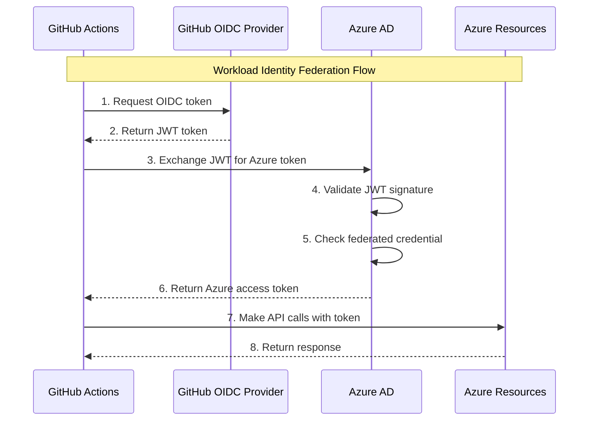

# GitHub Actions Authentication with Azure - Complete Guide

This guide explains how to securely authenticate GitHub Actions workflows with Azure for AKSFlexNode E2E testing.

## Table of Contents

- [Overview](#overview)
- [Authentication Methods Comparison](#authentication-methods-comparison)
- [Recommended Approach: Workload Identity Federation](#recommended-approach-workload-identity-federation)
- [Alternative: Service Principal with Secret](#alternative-service-principal-with-secret)
- [Implementation Steps](#implementation-steps)
- [Security Best Practices](#security-best-practices)
- [Troubleshooting](#troubleshooting)

---

## Overview

GitHub Actions workflows need to authenticate with Azure to:
1. **Provision test VMs** - Create/delete Azure VMs for E2E testing
2. **Manage Arc resources** - Register VMs with Azure Arc
3. **Configure RBAC** - Assign roles to Arc managed identities
4. **Access AKS cluster** - Validate node registration

**Key Requirement:** The authentication must work in a non-interactive CI/CD environment.

---

## Authentication Methods Comparison

### Option 1: Workload Identity Federation (OIDC) ⭐ RECOMMENDED

**How it works:**
- GitHub Actions generates a short-lived OIDC token
- Azure AD trusts GitHub's OIDC provider
- Token is exchanged for Azure access token
- **No secrets stored in GitHub**

**Pros:**
- ✅ **No secrets to manage** - Most secure option
- ✅ **Short-lived tokens** - Tokens expire automatically
- ✅ **No secret rotation** - Nothing to expire or rotate
- ✅ **Audit trail** - Clear identity in Azure logs
- ✅ **GitHub recommended** - Official best practice

**Cons:**
- ⚠️ Requires Azure AD configuration
- ⚠️ More complex initial setup

**Security Rating:** ⭐⭐⭐⭐⭐ (5/5)

---

### Option 2: Service Principal with Client Secret

**How it works:**
- Create Azure AD App Registration
- Generate client secret
- Store secret in GitHub Secrets
- Use secret to authenticate

**Pros:**
- ✅ Simple to set up
- ✅ Well-documented
- ✅ Works immediately

**Cons:**
- ⚠️ Secrets stored in GitHub
- ⚠️ Must rotate secrets regularly (recommended: 90 days)
- ⚠️ Risk of secret exposure in logs
- ⚠️ Long-lived credentials

**Security Rating:** ⭐⭐⭐ (3/5)

---

### Option 3: Self-Hosted Runner with Managed Identity

**How it works:**
- Deploy GitHub Actions runner on Azure VM
- VM has Azure Managed Identity assigned
- Runner uses VM's identity for Azure auth

**Pros:**
- ✅ No secrets at all
- ✅ Seamless authentication
- ✅ Very secure

**Cons:**
- ⚠️ Requires managing runner infrastructure
- ⚠️ Runner maintenance overhead
- ⚠️ Higher cost (persistent VM)
- ⚠️ State management between test runs

**Security Rating:** ⭐⭐⭐⭐ (4/5)

**Use case:** Best for organizations already using self-hosted runners

---

## Recommended Approach: Workload Identity Federation

### Architecture



### Benefits for AKSFlexNode

1. **Security:** No secrets in GitHub repository
2. **Compliance:** Meets enterprise security requirements
3. **Auditing:** Clear identity trail (GitHub repo → Azure AD App)
4. **Maintenance:** Zero secret rotation overhead

---

## Implementation Steps

### Method 1: Workload Identity Federation (RECOMMENDED)

#### Step 1: Create Azure AD Application

```bash
#!/bin/bash
set -euo pipefail

# Configuration
APP_NAME="github-aksflexnode-e2e"
SUBSCRIPTION_ID=$(az account show --query id -o tsv)
RESOURCE_GROUP="rg-aksflexnode-e2e-tests"
GITHUB_ORG="YourGitHubOrg"  # Replace with your org or username
GITHUB_REPO="AKSFlexNode"     # Replace with your repo name

echo "Creating Azure AD Application: $APP_NAME"

# Create Azure AD Application
APP_ID=$(az ad app create \
  --display-name "$APP_NAME" \
  --query appId -o tsv)

echo "Application created: $APP_ID"

# Create Service Principal
SP_OBJECT_ID=$(az ad sp create \
  --id "$APP_ID" \
  --query id -o tsv)

echo "Service Principal created: $SP_OBJECT_ID"

# Wait for propagation
echo "Waiting for Azure AD propagation..."
sleep 10

echo "✅ Azure AD Application created successfully"
echo ""
echo "Application ID: $APP_ID"
echo "Service Principal Object ID: $SP_OBJECT_ID"
echo ""
echo "Save these values - you'll need them for the next steps!"
```

#### Step 2: Configure Federated Credentials

```bash
#!/bin/bash
set -euo pipefail

# Configuration (use values from Step 1)
APP_ID="<your-app-id-from-step-1>"
GITHUB_ORG="YourGitHubOrg"      # Replace
GITHUB_REPO="AKSFlexNode"        # Replace

echo "Configuring federated credentials for GitHub Actions"

# Create federated credential for main branch
az ad app federated-credential create \
  --id "$APP_ID" \
  --parameters '{
    "name": "github-main-branch",
    "issuer": "https://token.actions.githubusercontent.com",
    "subject": "repo:'"$GITHUB_ORG"'/'"$GITHUB_REPO"':ref:refs/heads/main",
    "audiences": ["api://AzureADTokenExchange"],
    "description": "GitHub Actions - main branch"
  }'

echo "✅ Federated credential created for main branch"

# Create federated credential for dev branch
az ad app federated-credential create \
  --id "$APP_ID" \
  --parameters '{
    "name": "github-dev-branch",
    "issuer": "https://token.actions.githubusercontent.com",
    "subject": "repo:'"$GITHUB_ORG"'/'"$GITHUB_REPO"':ref:refs/heads/dev",
    "audiences": ["api://AzureADTokenExchange"],
    "description": "GitHub Actions - dev branch"
  }'

echo "✅ Federated credential created for dev branch"

# Create federated credential for pull requests
az ad app federated-credential create \
  --id "$APP_ID" \
  --parameters '{
    "name": "github-pull-requests",
    "issuer": "https://token.actions.githubusercontent.com",
    "subject": "repo:'"$GITHUB_ORG"'/'"$GITHUB_REPO"':pull_request",
    "audiences": ["api://AzureADTokenExchange"],
    "description": "GitHub Actions - pull requests"
  }'

echo "✅ Federated credential created for pull requests"

# Create federated credential for tags (releases)
az ad app federated-credential create \
  --id "$APP_ID" \
  --parameters '{
    "name": "github-tags",
    "issuer": "https://token.actions.githubusercontent.com",
    "subject": "repo:'"$GITHUB_ORG"'/'"$GITHUB_REPO"':ref:refs/tags/v*",
    "audiences": ["api://AzureADTokenExchange"],
    "description": "GitHub Actions - release tags"
  }'

echo "✅ Federated credential created for tags"

# List all federated credentials
echo ""
echo "All federated credentials:"
az ad app federated-credential list --id "$APP_ID" -o table

echo ""
echo "✅ Federated credentials configured successfully"
```

**Understanding the `subject` field:**

| Scenario | Subject Pattern |
|----------|----------------|
| **Main branch** | `repo:ORG/REPO:ref:refs/heads/main` |
| **Dev branch** | `repo:ORG/REPO:ref:refs/heads/dev` |
| **Any branch** | `repo:ORG/REPO:ref:refs/heads/*` |
| **Pull requests** | `repo:ORG/REPO:pull_request` |
| **Specific tag** | `repo:ORG/REPO:ref:refs/tags/v1.0.0` |
| **Tag pattern** | `repo:ORG/REPO:ref:refs/tags/v*` |
| **Any environment** | `repo:ORG/REPO:environment:production` |

#### Step 3: Assign Azure RBAC Roles

```bash
#!/bin/bash
set -euo pipefail

# Configuration (use values from Step 1)
APP_ID="<your-app-id-from-step-1>"
SUBSCRIPTION_ID=$(az account show --query id -o tsv)
RESOURCE_GROUP="rg-aksflexnode-e2e-tests"
AKS_CLUSTER_NAME="aks-flexnode-e2e-cluster"

echo "Assigning Azure RBAC roles to Service Principal"

# Get Service Principal Object ID
SP_OBJECT_ID=$(az ad sp show --id "$APP_ID" --query id -o tsv)

# Get AKS Resource ID
AKS_RESOURCE_ID=$(az aks show \
  --resource-group "$RESOURCE_GROUP" \
  --name "$AKS_CLUSTER_NAME" \
  --query id -o tsv)

echo "Service Principal Object ID: $SP_OBJECT_ID"
echo "AKS Resource ID: $AKS_RESOURCE_ID"

# 1. Contributor role on resource group (to create/delete VMs)
echo "Assigning Contributor role on resource group..."
az role assignment create \
  --assignee "$SP_OBJECT_ID" \
  --role "Contributor" \
  --scope "/subscriptions/$SUBSCRIPTION_ID/resourceGroups/$RESOURCE_GROUP"

# 2. Azure Connected Machine Onboarding (for Arc registration)
echo "Assigning Azure Connected Machine Onboarding role..."
az role assignment create \
  --assignee "$SP_OBJECT_ID" \
  --role "Azure Connected Machine Onboarding" \
  --scope "/subscriptions/$SUBSCRIPTION_ID/resourceGroups/$RESOURCE_GROUP"

# 3. User Access Administrator on AKS cluster (to assign roles to Arc MSI)
echo "Assigning User Access Administrator role on AKS cluster..."
az role assignment create \
  --assignee "$SP_OBJECT_ID" \
  --role "User Access Administrator" \
  --scope "$AKS_RESOURCE_ID"

# 4. Azure Kubernetes Service Cluster Admin Role
echo "Assigning AKS Cluster Admin role..."
az role assignment create \
  --assignee "$SP_OBJECT_ID" \
  --role "Azure Kubernetes Service Cluster Admin Role" \
  --scope "$AKS_RESOURCE_ID"

# Wait for propagation
echo "Waiting for role assignment propagation..."
sleep 30

# Verify role assignments
echo ""
echo "Verifying role assignments:"
az role assignment list \
  --assignee "$SP_OBJECT_ID" \
  --all \
  --query "[].{Role:roleDefinitionName, Scope:scope}" \
  -o table

echo ""
echo "✅ RBAC roles assigned successfully"
```

#### Step 4: Configure GitHub Repository Secrets

You only need **3 secrets** (no client secret!):

```bash
# Go to: https://github.com/YOUR_ORG/AKSFlexNode/settings/secrets/actions

# Click "New repository secret" and add:

1. AZURE_CLIENT_ID
   Value: <your-app-id-from-step-1>

2. AZURE_SUBSCRIPTION_ID
   Value: <your-subscription-id>

3. AZURE_TENANT_ID
   Value: <your-tenant-id>

# Additional secrets for E2E tests:
4. E2E_RESOURCE_GROUP
   Value: rg-aksflexnode-e2e-tests

5. E2E_AKS_CLUSTER_NAME
   Value: aks-flexnode-e2e-cluster

6. E2E_AKS_RESOURCE_ID
   Value: <full-aks-resource-id>

7. E2E_LOCATION
   Value: westus
```

**Get your Tenant ID:**
```bash
az account show --query tenantId -o tsv
```

#### Step 5: Update GitHub Actions Workflow

Create or update `.github/workflows/e2e-tests-oidc.yml`:

```yaml
name: E2E Tests (OIDC Auth)

on:
  workflow_dispatch:
  push:
    tags:
      - 'v*'

permissions:
  id-token: write      # Required for OIDC token
  contents: read

env:
  GO_VERSION: '1.24'
  AZURE_LOCATION: westus

jobs:
  e2e-test:
    name: E2E Test with OIDC Auth
    runs-on: ubuntu-latest
    timeout-minutes: 30

    steps:
      - name: Checkout code
        uses: actions/checkout@v4

      - name: Set up Go
        uses: actions/setup-go@v5
        with:
          go-version: ${{ env.GO_VERSION }}
          cache: true

      - name: Build binary for E2E testing
        run: |
          VERSION="${GITHUB_REF_NAME:-dev}"
          GIT_COMMIT=$(git rev-parse --short HEAD)
          BUILD_DATE=$(date -u +"%Y-%m-%dT%H:%M:%SZ")

          LDFLAGS="-X main.Version=${VERSION} -X main.GitCommit=${GIT_COMMIT} -X main.BuildTime=${BUILD_DATE}"

          GOOS=linux GOARCH=amd64 go build -ldflags "${LDFLAGS}" -o aks-flex-node .
          chmod +x aks-flex-node

      # Azure Login with OIDC (no secret needed!)
      - name: Azure Login via OIDC
        uses: azure/login@v1
        with:
          client-id: ${{ secrets.AZURE_CLIENT_ID }}
          tenant-id: ${{ secrets.AZURE_TENANT_ID }}
          subscription-id: ${{ secrets.AZURE_SUBSCRIPTION_ID }}

      - name: Verify Azure Authentication
        run: |
          echo "Testing Azure authentication..."
          az account show
          echo "✅ Azure authentication successful"

      - name: Provision Test VM
        id: provision
        run: |
          chmod +x scripts/e2e/provision-vm.sh

          export E2E_RESOURCE_GROUP="${{ secrets.E2E_RESOURCE_GROUP }}"
          export E2E_LOCATION="${{ secrets.E2E_LOCATION || env.AZURE_LOCATION }}"

          ./scripts/e2e/provision-vm.sh

      - name: Generate test config with Service Principal
        run: |
          UNIQUE_NAME="e2e-node-$(date +%s)"

          # For the test VM, we need to pass SP credentials in config
          # The VM itself uses these credentials to register with Arc
          cat > config.json <<EOF
          {
            "azure": {
              "subscriptionId": "${{ secrets.AZURE_SUBSCRIPTION_ID }}",
              "tenantId": "${{ secrets.AZURE_TENANT_ID }}",
              "cloud": "AzurePublicCloud",
              "servicePrincipal": {
                "clientId": "${{ secrets.AZURE_CLIENT_ID }}",
                "clientSecret": "PLACEHOLDER_SEE_NOTE_BELOW"
              },
              "arc": {
                "machineName": "${UNIQUE_NAME}",
                "resourceGroup": "${{ secrets.E2E_RESOURCE_GROUP }}",
                "location": "${{ secrets.E2E_LOCATION || env.AZURE_LOCATION }}",
                "autoRoleAssignment": true,
                "tags": {
                  "environment": "e2e-test",
                  "github-run": "${{ github.run_id }}"
                }
              },
              "targetCluster": {
                "resourceId": "${{ secrets.E2E_AKS_RESOURCE_ID }}",
                "location": "${{ secrets.E2E_LOCATION || env.AZURE_LOCATION }}"
              }
            },
            "agent": {
              "logLevel": "debug",
              "logDir": "/var/log/aks-flex-node"
            }
          }
          EOF

      # Continue with test steps...
      - name: Upload binary and config to VM
        env:
          VM_PUBLIC_IP: ${{ env.VM_PUBLIC_IP }}
          VM_ADMIN_USER: ${{ env.VM_ADMIN_USER }}
        run: |
          ssh-keyscan -H $VM_PUBLIC_IP >> ~/.ssh/known_hosts
          scp aks-flex-node ${VM_ADMIN_USER}@${VM_PUBLIC_IP}:/tmp/
          scp config.json ${VM_ADMIN_USER}@${VM_PUBLIC_IP}:/tmp/
          scp scripts/e2e/test-bootstrap.sh ${VM_ADMIN_USER}@${VM_PUBLIC_IP}:/tmp/
          ssh ${VM_ADMIN_USER}@${VM_PUBLIC_IP} "chmod +x /tmp/test-*.sh"

      - name: Run bootstrap test
        id: bootstrap
        env:
          VM_PUBLIC_IP: ${{ env.VM_PUBLIC_IP }}
          VM_ADMIN_USER: ${{ env.VM_ADMIN_USER }}
        run: |
          ssh ${VM_ADMIN_USER}@${VM_PUBLIC_IP} "/tmp/test-bootstrap.sh /tmp/aks-flex-node /tmp/config.json"

      # Add remaining steps: unbootstrap, logs, cleanup...
```

**Key Changes for OIDC:**

1. **Added permissions:**
   ```yaml
   permissions:
     id-token: write   # Required for OIDC
     contents: read
   ```

2. **Simplified Azure login:**
   ```yaml
   - uses: azure/login@v1
     with:
       client-id: ${{ secrets.AZURE_CLIENT_ID }}
       tenant-id: ${{ secrets.AZURE_TENANT_ID }}
       subscription-id: ${{ secrets.AZURE_SUBSCRIPTION_ID }}
       # No client-secret needed!
   ```

#### Step 6: Test the Setup

```bash
# Manually trigger the workflow from GitHub UI:
# 1. Go to Actions tab
# 2. Select "E2E Tests (OIDC Auth)"
# 3. Click "Run workflow"
# 4. Monitor the logs

# Or use GitHub CLI:
gh workflow run e2e-tests-oidc.yml
```

---

## Alternative: Service Principal with Secret

If you need a simpler setup or can't use OIDC for some reason:

### Step 1: Create Service Principal

```bash
#!/bin/bash
set -euo pipefail

SUBSCRIPTION_ID=$(az account show --query id -o tsv)
RESOURCE_GROUP="rg-aksflexnode-e2e-tests"
SP_NAME="sp-aksflexnode-e2e"

echo "Creating Service Principal with secret..."

# Create SP with Contributor role on resource group
SP_OUTPUT=$(az ad sp create-for-rbac \
  --name "$SP_NAME" \
  --role "Contributor" \
  --scopes "/subscriptions/$SUBSCRIPTION_ID/resourceGroups/$RESOURCE_GROUP" \
  --sdk-auth)

echo "$SP_OUTPUT" > sp-credentials.json

# Extract values
CLIENT_ID=$(echo "$SP_OUTPUT" | jq -r '.clientId')
CLIENT_SECRET=$(echo "$SP_OUTPUT" | jq -r '.clientSecret')
TENANT_ID=$(echo "$SP_OUTPUT" | jq -r '.tenantId')

echo ""
echo "✅ Service Principal created successfully"
echo ""
echo "Client ID: $CLIENT_ID"
echo "Client Secret: [REDACTED - see sp-credentials.json]"
echo "Tenant ID: $TENANT_ID"
echo ""
echo "⚠️  IMPORTANT: Store sp-credentials.json securely and delete after adding to GitHub Secrets"
```

### Step 2: Assign Additional Roles

```bash
# Use same script as OIDC Step 3, but with CLIENT_ID from SP creation
APP_ID="<client-id-from-step-1>"
# ... rest of the role assignment script
```

### Step 3: Configure GitHub Secrets

```bash
# Add 4 secrets (includes client secret):

1. AZURE_CLIENT_ID
2. AZURE_CLIENT_SECRET    # ← Additional secret needed
3. AZURE_SUBSCRIPTION_ID
4. AZURE_TENANT_ID

# Plus E2E test configuration secrets (same as OIDC)
```

### Step 4: Use Standard Azure Login

```yaml
- name: Azure Login with Secret
  uses: azure/login@v1
  with:
    creds: '{"clientId":"${{ secrets.AZURE_CLIENT_ID }}","clientSecret":"${{ secrets.AZURE_CLIENT_SECRET }}","subscriptionId":"${{ secrets.AZURE_SUBSCRIPTION_ID }}","tenantId":"${{ secrets.AZURE_TENANT_ID }}"}'
```

### Step 5: Set Secret Expiration Reminder

```bash
# Secrets typically expire in 1-2 years
# Set a calendar reminder to rotate in 90 days

# Check current secret expiration:
az ad app credential list --id <app-id>
```

---

## Security Best Practices

### 1. Principle of Least Privilege

**✅ DO:**
```yaml
# Scope roles to specific resource group
Scope: /subscriptions/{sub}/resourceGroups/{rg}
```

**❌ DON'T:**
```yaml
# Don't give subscription-wide permissions
Scope: /subscriptions/{sub}
```

### 2. Separate Environments

```bash
# Different service principals for different environments
sp-aksflexnode-e2e-dev      # For development testing
sp-aksflexnode-e2e-staging  # For staging validation
sp-aksflexnode-e2e-prod     # For production releases
```

### 3. Audit and Monitor

```bash
# Enable Azure AD sign-in logs
# Monitor for unexpected authentication attempts

# Query Azure AD sign-in logs for your SP
az monitor activity-log list \
  --caller "github-aksflexnode-e2e" \
  --start-time "2024-01-01" \
  --query "[].{Time:eventTimestamp, Operation:operationName.value, Status:status.value}"
```

### 4. Use Azure Policies

```json
{
  "if": {
    "field": "type",
    "equals": "Microsoft.HybridCompute/machines"
  },
  "then": {
    "effect": "audit",
    "details": {
      "type": "Microsoft.HybridCompute/machines",
      "existenceCondition": {
        "field": "tags['github-run']",
        "exists": true
      }
    }
  }
}
```

### 5. Secrets Management (If Using Secrets)

**GitHub Secrets Security:**
```yaml
# ✅ GOOD - Secret is masked in logs
- name: Test connection
  run: |
    echo "::add-mask::${{ secrets.AZURE_CLIENT_SECRET }}"
    # Secret will show as *** in logs

# ❌ BAD - Secret could leak
- name: Debug (DON'T DO THIS)
  run: echo "Secret is ${{ secrets.AZURE_CLIENT_SECRET }}"
```

### 6. Network Security

```bash
# Restrict VM access to GitHub Actions IP ranges
# https://api.github.com/meta (actions field)

# Create NSG rule to allow SSH only from GitHub Actions
az network nsg rule create \
  --resource-group "$RESOURCE_GROUP" \
  --nsg-name "nsg-e2e-test" \
  --name "AllowGitHubActionsSSH" \
  --priority 100 \
  --source-address-prefixes "$(curl -s https://api.github.com/meta | jq -r '.actions[]')" \
  --destination-port-ranges 22 \
  --protocol Tcp \
  --access Allow
```

---

## Troubleshooting

### Issue 1: "Failed to get OIDC token"

**Symptoms:**
```
Error: Unable to get OIDC token. Please check if the GitHub Actions workflow has id-token: write permissions.
```

**Solution:**
```yaml
# Add to workflow file at job or workflow level:
permissions:
  id-token: write
  contents: read
```

---

### Issue 2: "Federated credential not found"

**Symptoms:**
```
Error: AADSTS70021: No matching federated identity record found for presented assertion.
```

**Solution:**
```bash
# Verify federated credential subject matches your workflow
az ad app federated-credential list --id <app-id>

# Check the subject pattern matches:
# - Branch: repo:ORG/REPO:ref:refs/heads/BRANCH
# - PR: repo:ORG/REPO:pull_request
# - Tag: repo:ORG/REPO:ref:refs/tags/TAG_PATTERN
```

---

### Issue 3: "Insufficient privileges"

**Symptoms:**
```
Error: The client 'xxx' with object id 'yyy' does not have authorization to perform action...
```

**Solution:**
```bash
# Verify role assignments
az role assignment list --assignee <client-id> --all -o table

# Re-assign missing roles
az role assignment create \
  --assignee <client-id> \
  --role "RoleName" \
  --scope "/subscriptions/{sub}/resourceGroups/{rg}"

# Wait for propagation (can take 5-10 minutes)
```

---

### Issue 4: "Token exchange failed"

**Symptoms:**
```
Error: Unable to exchange GitHub OIDC token for Azure token
```

**Solution:**
```bash
# Check Azure AD application configuration
az ad app show --id <app-id>

# Verify federated credentials exist
az ad app federated-credential list --id <app-id> -o table

# Check issuer is correct (should be GitHub):
# https://token.actions.githubusercontent.com
```

---

### Issue 5: Service Principal on Test VM

**Challenge:**
The GitHub Actions workflow uses OIDC (no secret), but the test VM running `aks-flex-node` needs credentials to authenticate with Azure Arc.

**Solutions:**

**Option A: Create Separate SP for VM Testing** (Recommended)
```bash
# Create a separate SP specifically for the test VM
az ad sp create-for-rbac \
  --name "sp-aksflexnode-vm-test" \
  --role "Azure Connected Machine Onboarding" \
  --scopes "/subscriptions/$SUBSCRIPTION_ID/resourceGroups/$RESOURCE_GROUP"

# Add to GitHub Secrets:
# - E2E_VM_CLIENT_ID
# - E2E_VM_CLIENT_SECRET

# Use in workflow to generate config:
cat > config.json <<EOF
{
  "azure": {
    "servicePrincipal": {
      "clientId": "${{ secrets.E2E_VM_CLIENT_ID }}",
      "clientSecret": "${{ secrets.E2E_VM_CLIENT_SECRET }}"
    },
    ...
  }
}
EOF
```

**Option B: Generate Temporary Credential**
```bash
# In workflow, use main SP to generate temporary access token
- name: Generate temp credentials for VM
  run: |
    # Get access token using OIDC-authenticated session
    TOKEN=$(az account get-access-token --query accessToken -o tsv)

    # This is complex and not recommended - use Option A
```

**Option C: Use Azure Key Vault** (Enterprise)
```yaml
- name: Get VM credentials from Key Vault
  uses: azure/get-keyvault-secrets@v1
  with:
    keyvault: "kv-aksflexnode-e2e"
    secrets: 'vm-client-id, vm-client-secret'
```

**Recommended: Use Option A** - Simple, secure, and maintainable.

---

## Summary & Recommendations

### For AKSFlexNode E2E Pipeline:

#### ✅ RECOMMENDED: Hybrid Approach

1. **GitHub Actions ↔ Azure:** Use **OIDC/Workload Identity Federation**
   - No secrets stored in GitHub
   - Provisions VMs and manages Azure resources
   - Most secure option

2. **Test VM → Azure Arc:** Use **Service Principal with Secret**
   - Separate SP dedicated for VM testing
   - Secret passed via config file to test VM
   - Acceptable because VM is ephemeral (deleted after test)

#### Setup Summary:

```bash
# 1. Main SP for GitHub Actions (OIDC - no secret)
App: github-aksflexnode-e2e
Auth: OIDC Federated Credential
Roles: Contributor, Arc Onboarding, User Access Admin, AKS Admin
Usage: GitHub Actions workflow

# 2. VM Test SP (with secret)
App: sp-aksflexnode-vm-test
Auth: Client Secret
Roles: Arc Onboarding, Arc Resource Bridge Contributor
Usage: Test VM config file (ephemeral)

# GitHub Secrets (6 total):
AZURE_CLIENT_ID          # Main SP for OIDC
AZURE_TENANT_ID
AZURE_SUBSCRIPTION_ID
E2E_VM_CLIENT_ID         # VM test SP
E2E_VM_CLIENT_SECRET     # VM test SP secret
E2E_AKS_RESOURCE_ID
```

#### Implementation Checklist:

- [ ] Create main Azure AD app for OIDC (Step 1-3)
- [ ] Configure federated credentials (Step 2)
- [ ] Assign RBAC roles (Step 3)
- [ ] Create separate SP for VM testing
- [ ] Add secrets to GitHub (Step 4)
- [ ] Update workflow to use OIDC (Step 5)
- [ ] Test authentication end-to-end (Step 6)
- [ ] Document credential rotation process (if using secrets)
- [ ] Set up monitoring for auth failures

This approach gives you:
- ✅ Maximum security for GitHub Actions (OIDC)
- ✅ Practical testing setup for VMs (SP with secret)
- ✅ Clear separation of concerns
- ✅ Minimal secrets management overhead

---

## Additional Resources

- [GitHub Actions OIDC with Azure](https://docs.github.com/en/actions/deployment/security-hardening-your-deployments/configuring-openid-connect-in-azure)
- [Azure Workload Identity Federation](https://learn.microsoft.com/en-us/azure/active-directory/develop/workload-identity-federation)
- [Azure/login Action](https://github.com/Azure/login)
- [Azure RBAC Best Practices](https://learn.microsoft.com/en-us/azure/role-based-access-control/best-practices)
